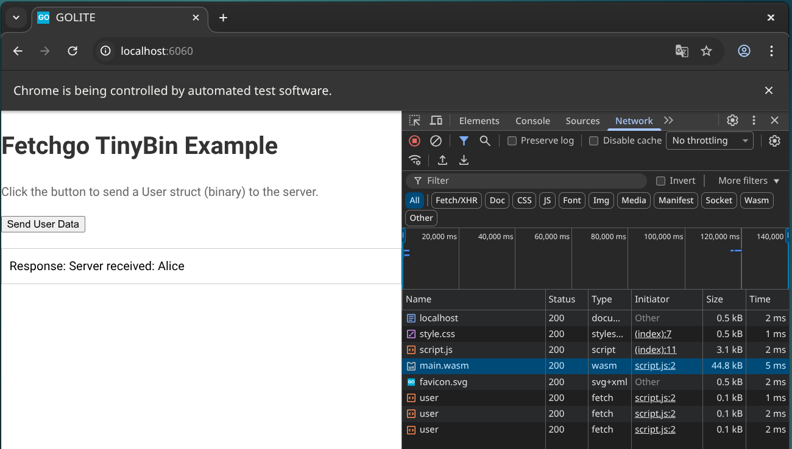

# fetchgo

Minimal Go HTTP library for unified requests in Browser (WASM) and Server.

## Features

- **Unified API**: Write once, run on Server (`net/http`) and Browser (`syscall/js`).
- **TinyGo Compatible**: Optimized for small WASM binaries (~45KB gzipped).
- **Encoding Support**: Automatic JSON and [TinyBin](https://github.com/tinywasm/tinybin) encoding for structs (raw bytes sent as-is).

## Installation

```bash
go get github.com/tinywasm/fetch
```

## Usage

```go
package main

import (
    "github.com/tinywasm/fetch"
)

func main() {
    fg := fetchgo.New()
    // Client with 5s timeout
    client := fg.NewClient("https://api.example.com", 5000)

    userData := User{ Name: "Alice", Age: 30 }

    // Send JSON request
    client.SendJSON("GET", "/data", userData, func(resp []byte, err error) {
        if err != nil {
            println("Error:", err)
            return
        }
        println("Response:", string(resp))
    })

    // or Send Binary request
    // client.SendBinary("POST", "/upload", userData, ...
}
```

## snapshots

### browser



### servidor ([golite](github.com/tinywasm/app))


## Documentation
- [Fetch Example](example/README.md)
- [API Reference](docs/API.md)
- [Architecture Details](docs/ARCHITECTURE.md)
- [Migration Guide](docs/MIGRATION.md)

## License

MIT
